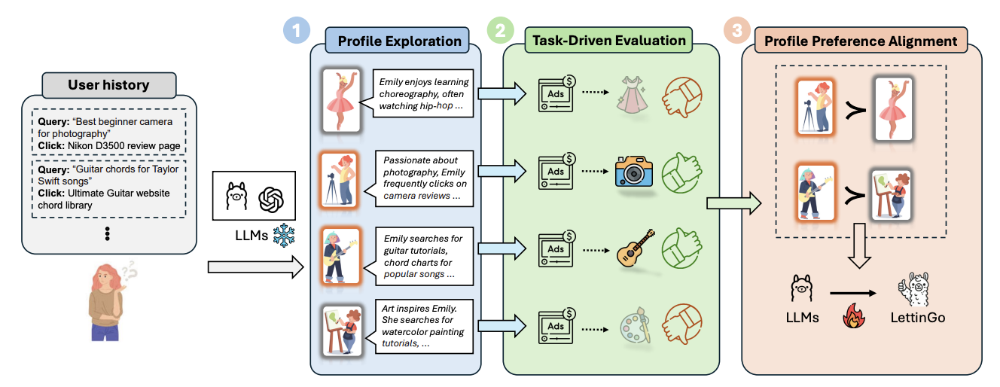

# LettinGo: Explore User Profile Generation for Recommendation System

[](https://arxiv.org/abs/2506.18309)

In this paper, we propose **LettinGo**, a novel framework for adaptive and diverse user profile generation in recommendation systems. Instead of relying on rigid supervised fine-tuning formats, LettinGo leverages the expressive capacity of large language models (LLMs) and aligns profile generation directly with downstream recommendation performance. The framework operates in three stages: (1) exploring diverse user profile candidates using multiple LLMs, (2) evaluating profile quality based on their impact on recommendation tasks, and (3) optimizing the profile generator via Direct Preference Optimization (DPO) using pairwise preferences derived from task outcomes. Experiments show that learning from task-driven feedback enables more flexible, context-aware, and effective user representations, significantly improving recommendation accuracy and adaptability.

This Codebase is GRPO version, DPO version is coming soon.

<div align="center">
  
</div>

## 🚀 Getting Started

### 🧰 Environment Setup
```bash
# step1: create conda env
conda create -n verl python==3.12

# step2: activate env and setup verl
# ref: https://verl.readthedocs.io/en/latest/start/install.html#install-dependencies
conda init
source ~/.bashrc
conda activate verl
cd duet/verl
USE_MEGATRON=0 bash scripts/install_vllm_sglang_mcore.sh
```

### 🌐 Run API Server
You should start an API server to handle model inference requests for downstream recommendation score tasks.

```bash
cd duet
bash scripts/run_api_call_server.sh
```
Before running the script, make sure to set the correct model path inside the script.

### 🎯 Run Training
You can use the provided script to launch training:

```bash
cd duet
bash scripts/run_training.sh
```
Before running the script, make sure to set the correct paths for your work directory, model, dataset, wandb, and logging directory.

## Citation
If you find this repository useful, please considering giving ⭐ or citing:
```
@inproceedings{wang2025lettingo,
  title={Lettingo: Explore user profile generation for recommendation system},
  author={Wang, Lu and Zhang, Di and Yang, Fangkai and Zhao, Pu and Liu, Jianfeng and Zhan, Yuefeng and Sun, Hao and Lin, Qingwei and Deng, Weiwei and Zhang, Dongmei and others},
  booktitle={Proceedings of the 31st ACM SIGKDD Conference on Knowledge Discovery and Data Mining V. 2},
  pages={2985--2995},
  year={2025}
}
```

## Contributing

This project welcomes contributions and suggestions.  Most contributions require you to agree to a
Contributor License Agreement (CLA) declaring that you have the right to, and actually do, grant us
the rights to use your contribution. For details, visit https://cla.opensource.microsoft.com.

When you submit a pull request, a CLA bot will automatically determine whether you need to provide
a CLA and decorate the PR appropriately (e.g., status check, comment). Simply follow the instructions
provided by the bot. You will only need to do this once across all repos using our CLA.

This project has adopted the [Microsoft Open Source Code of Conduct](https://opensource.microsoft.com/codeofconduct/).
For more information see the [Code of Conduct FAQ](https://opensource.microsoft.com/codeofconduct/faq/) or
contact [opencode@microsoft.com](mailto:opencode@microsoft.com) with any additional questions or comments.

## Trademarks

This project may contain trademarks or logos for projects, products, or services. Authorized use of Microsoft 
trademarks or logos is subject to and must follow 
[Microsoft's Trademark & Brand Guidelines](https://www.microsoft.com/en-us/legal/intellectualproperty/trademarks/usage/general).
Use of Microsoft trademarks or logos in modified versions of this project must not cause confusion or imply Microsoft sponsorship.
Any use of third-party trademarks or logos are subject to those third-party's policies.
