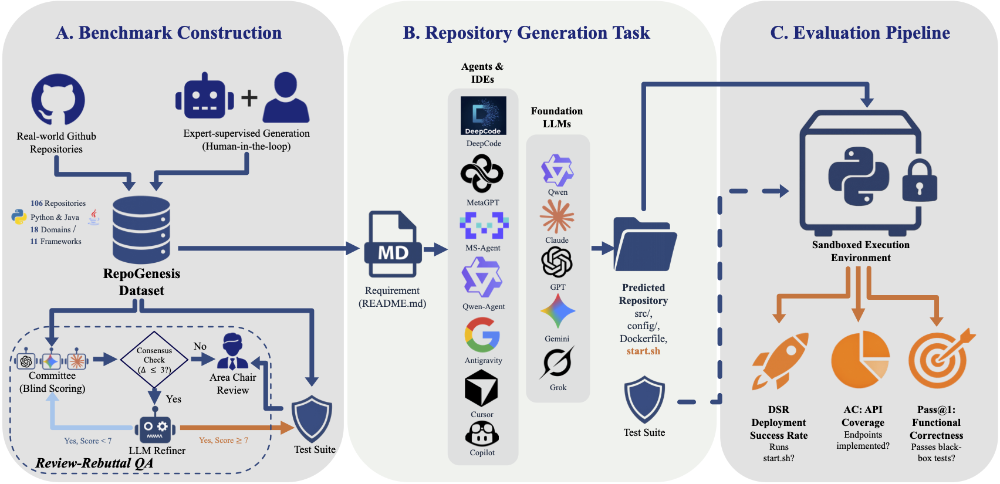

# RepoGenesis: Benchmarking End-to-End Microservice Generation from Readme to Repository 🚀

[//]: # ([![Project]&#40;http://img.shields.io/badge/Project-SER-E3E4C8.svg&#41;]&#40;https://microsoft.github.io/DKI_LLM/ser/ser_index.html&#41;)

[](https://arxiv.org/abs/2505.17540)

This repository contains the code and data for RepoGenesis, the first multilingual benchmark for repository-level end-to-end web microservice generation. RepoGenesis assesses LLMs' capability in generating complete web microservice repositories from natural language requirements.

## Overview ⭐

<div align="center">
  
</div>

RepoGenesis is the first benchmark for evaluating repository-level microservice generation from natural language requirements. Unlike existing benchmarks that focus on function-level or class-level code generation, RepoGenesis challenges LLMs to generate repositories from scratch.

**Key Features:**
- **106 diverse web microservice repositories** (60 Python, 46 Java)
- **11 frameworks** including Django, FastAPI, Javalin, Spring Boot, and more
- **18 application domains** covering authentication, content management, gaming, file management, and more
- **Multi-dimensional metrics**: Pass@1 for functional correctness, API Coverage (AC) for implementation completeness, and Deployment Success Rate (DSR) for deployability
- **Support for multiple agents**: MetaGPT , DeepCode , Qwen-Agent , MS-Agent , and commercial IDEs like Cursor  and Copilot 

## Installation 🚀

### Prerequisites 📋

- **Python**: 3.10 or higher
- **Java**: JDK 17 or higher (for Java repository evaluation)
- **Conda**: Required for isolated test environments
- **Git**: For repository management


### Step 1: Install Python Dependencies 📦

```bash
pip install -r requirements.txt
```

### Step 2: Configure API Keys 📝

The benchmark supports multiple LLM providers. Configure your API keys as environment variables:

```bash
export OPENAI_API_KEY="your-api-key"
export OPENAI_BASE_URL="https://api.openai.com/v1"  # Optional
```

### Step 3: Install Agent Frameworks (Optional) 📦

If you want to evaluate specific agent frameworks:

```bash
# MetaGPT
git clone https://github.com/FoundationAgents/MetaGPT.git
cd MetaGPT
pip install -e .

# DeepCode (requires additional configuration)
git clone https://github.com/HKUDS/DeepCode.git
cd DeepCode
pip install -e .

# Qwen-Agent
git clone https://github.com/QwenLM/Qwen-Agent.git
cd Qwen-Agent
pip install -e .

# MS-Agent
git clone https://github.com/modelscope/ms-agent.git
cd ms-agent
pip install -e .
```

## Usage 

### 1. Generate Repositories with Agents

#### For Python Repositories

```bash
# MetaGPT
python gen_and_eval.py \
    --agent metagpt \
    --repo_root repo \
    --repo_name <repository-name> \
    --llm_model gpt-4o \
    --llm_api_key $OPENAI_API_KEY

# DeepCode
python gen_and_eval.py \
    --agent deepcode \
    --repo_root repo \
    --repo_name <repository-name> \
    --deepcode_openai_key $OPENAI_API_KEY

# Qwen-Agent
python gen_and_eval.py \
    --agent qwen-agent \
    --repo_root repo \
    --repo_name <repository-name> \
    --llm_model qwen-max-latest \
    --llm_api_key $DASHSCOPE_API_KEY \
    --llm_base_url https://dashscope.aliyuncs.com/compatible-mode/v1
```

#### For Java Repositories (the same args with Python)

```bash
python gen_and_eval_Java.py \
    --agent <agent-name> \
    --repo_root repo_java \
    --repo_name <java-repository-name> \
    --llm_model gpt-4o \
    --llm_api_key $OPENAI_API_KEY
```

### 2. Evaluate Generated Repositories

#### Basic Evaluation (Pass@1)

```bash
python evaluate_repos.py \
    --answer_dir <path-to-generated-repos> \
    --test_dir repo_golden_oracle \
    --output evaluation_results.json
```

This will:
1. Install repository dependencies
2. Start the service (if `start.sh` exists)
3. Run pytest test suite
4. Calculate Pass@1, coverage, and code metrics
5. Save results to JSON

#### Calculate API Coverage

```bash
# For IDEs
python calculate_api_coverage_ide.py

# For open-source agents
python calculate_api_coverage_agents.py
```

API Coverage (AC) measures what percentage of required API endpoints are correctly implemented in the generated repository.

#### Deployment Success Rate (DSR)

```bash
# For IDEs and open-source agents
python test_dsr_repos.py
```

DSR evaluation checks if generated repositories can be successfully deployed. See the paper for detailed methodology.

## Evaluation Metrics

### Pass@1 (Functional Correctness)

Measures whether the generated repository passes all test cases on the first attempt:

```
Pass@1 = (Number of passed test cases) / (Total test cases)
```

A repository achieves Pass@1 = 1.0 only if all test cases pass.

### API Coverage (AC)

Measures implementation completeness by checking if all required API endpoints are present:

```
AC = (Number of implemented API endpoints) / (Total required API endpoints)
```

API endpoints are extracted from README specifications and validated in the generated code.

### Deployment Success Rate (DSR)

Measures basic deployability by checking if:
1. Dependencies can be installed
2. Service can start without errors
3. Health check endpoint responds

### Reproducing Paper Results

1. **Generate repositories** for all agent/IDE configurations
2. **Run evaluations** using `evaluate_repos.py` and `evaluate_repos_java.py`
3. **Calculate metrics** using AC and DSR scripts
4. **Aggregate results** - metrics are automatically saved to JSON files

## Citation
If you find this repository useful, please considering giving ⭐ or citing:
```bibtex
@article{anonymous2025RepoGenesis,
  title={RepoGenesis: Benchmarking End-to-End Microservice Generation from Readme to Repository},
  author={Anonymous},
  journal={Under Review},
  year={2025}
}
```


## Contributing

This project welcomes contributions and suggestions.  Most contributions require you to agree to a
Contributor License Agreement (CLA) declaring that you have the right to, and actually do, grant us
the rights to use your contribution. For details, visit https://cla.opensource.microsoft.com.

When you submit a pull request, a CLA bot will automatically determine whether you need to provide
a CLA and decorate the PR appropriately (e.g., status check, comment). Simply follow the instructions
provided by the bot. You will only need to do this once across all repos using our CLA.

This project has adopted the [Microsoft Open Source Code of Conduct](https://opensource.microsoft.com/codeofconduct/).
For more information see the [Code of Conduct FAQ](https://opensource.microsoft.com/codeofconduct/faq/) or
contact [opencode@microsoft.com](mailto:opencode@microsoft.com) with any additional questions or comments.

## Trademarks

This project may contain trademarks or logos for projects, products, or services. Authorized use of Microsoft 
trademarks or logos is subject to and must follow 
[Microsoft's Trademark & Brand Guidelines](https://www.microsoft.com/en-us/legal/intellectualproperty/trademarks/usage/general).
Use of Microsoft trademarks or logos in modified versions of this project must not cause confusion or imply Microsoft sponsorship.
Any use of third-party trademarks or logos are subject to those third-party's policies.

## Question

If you want to contact the author, please email: `pzy2000@sjtu.edu.cn` and `xyin@zju.edu.cn`.
